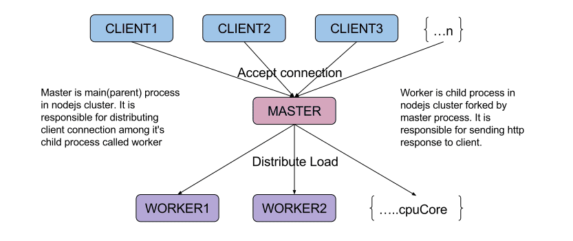

# NodeJS Cluster 🔥

## What is NodeJS Cluster?

Node. js runs single threaded programming, which is very memory efficient, but to take advantage of computers multi-core systems, the Cluster module allows you to easily create child processes that each runs on their own single thread, to handle the load.

## What is Blocking and Non-blocking operations?

Blocking refers to operations that block further execution until that operation finishes while non-blocking refers to code that doesn't block execution. Or as Node. js docs puts it, blocking is when the execution of additional JavaScript in the Node. js process must wait until a non-JavaScript operation completes.

## NodeJs Cluster modules

- A single instance of nodejs run in a single thread
- Cluster module allows to take advantage of multi-core system
- It help to create child process which shares server ports

